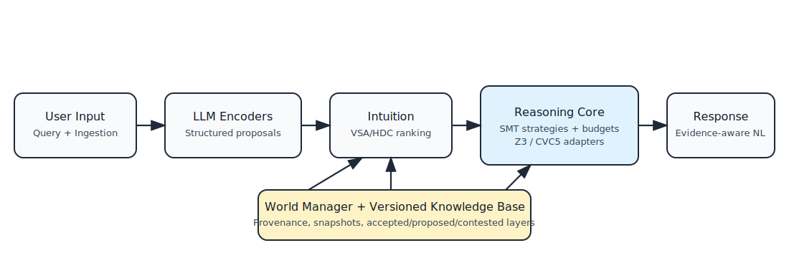

# DS002 - Architecture

## Architecture in One View

Diagram summary: user input enters the orchestration flow, LLM encoders produce structured formal proposals, the intuition layer selects relevant knowledge fragments, and the reasoning layer validates outcomes with solver backends. The response decoder verbalizes only evidence-approved results, while the world manager and versioned knowledge base provide isolation and traceability.

## Functional Components

HoloProof is organized around a chat orchestrator and five functional modules.

`Reasoning` runs incremental SMT workflows, selects solver strategy, enforces budgets, and returns solver artifacts (`sat/unsat/unknown`, models, unsat cores, execution logs).

`Intuition` builds and queries VSA/HDC/HRR representations to rank relevant knowledge fragments before expensive formal reasoning.

`LLMEncoder` converts user text and source material into structured `FormalProposal` JSON IR objects, each carrying provenance and ambiguity markers.

`QueryEncoder` turns a user question into a formal query plan, including expected verification mode and resource budget.

`ResponseDecoder` transforms validated solver outputs into natural-language answers with explicit references to formal evidence.

`World Manager` maintains world snapshots, lifecycle states for proposals, a versioned symbol registry used by validation/encoding modules, and world-level policy metadata (sensitivity, trace redaction, retention).

## Strategy-Oriented Adapters

HoloProof must support interchangeable solver and LLM strategies instead of hard-coding one backend.

For SMT, the `SolverAdapter` interface has at least two concrete strategies in scope: `z3` and `cvc5`. Both are invoked through SMT-LIB2 over subprocess I/O, and both expose the same normalized result contract to upper layers.

For LLM execution, HoloProof uses the API provided by the parent `AchillesAgentLib` project and treats model/provider selection as a strategy concern. The default integration path is `../AchillesAgentLib/LLMAgents` and `../AchillesAgentLib/utils/LLMClient.mjs`, which already supports provider/model resolution and fast/deep routing.

## Flow Contract

The orchestration contract is strict: no answer is emitted as validated knowledge unless the solver confirms the relevant formal claim in the current world and snapshot context.

Implementation boundary rule: domain logic is implemented in `src/sdk/` and reused by runtime entry points (evaluation CLI and chat runtime) to avoid contract drift between tools.
