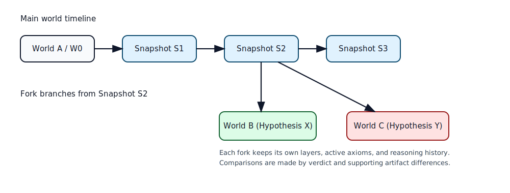

# DS003 - Worlds, Knowledge Base, and Forking

## World Model

A world is an isolated reasoning session. It contains a layered knowledge base, reasoning configuration, intuition index, and conversation history. All ingestion and querying operations run against one active world at a time.

Diagram summary: a base world evolves through snapshots, then branches into independent worlds for alternative hypotheses. Each branch can diverge safely without contaminating the original state.

## Knowledge Base Layers

Knowledge is stored as versioned fragments with stable identifiers and provenance. Each fragment keeps source metadata (document ID, offsets, timestamp), formal payload, semantic tags, and one lifecycle state: `proposed`, `accepted`, or `contested`.

The system never auto-promotes LLM-generated formalizations directly into stable truth. Formal payloads begin as `proposed`, pass structural and solver checks, and become `accepted` only after validation succeeds.

## Acceptance and Conflict Discipline

Validation applies three gates before acceptance: safe SMT-LIB2 syntax, signature consistency for declared symbols, and a solver sanity check in an isolated layer. If a proposal introduces inconsistency, the fragment set is marked `contested` and kept outside the stable layer.

When conflict appears, the orchestrator asks targeted clarification questions instead of forcing hidden assumptions. This behavior is required for preserving logical integrity and user trust.

## Snapshot and Fork Semantics

A snapshot captures a world state at a specific point in time. A fork creates a new world from an existing snapshot and writes future changes into new layers. This enables controlled experimentation with alternative interpretations, domain restrictions, or temporary assumptions.

Comparing worlds is a first-class operation. Comparison reports should focus on changed active axioms, query verdict differences, and the supporting solver artifacts.
